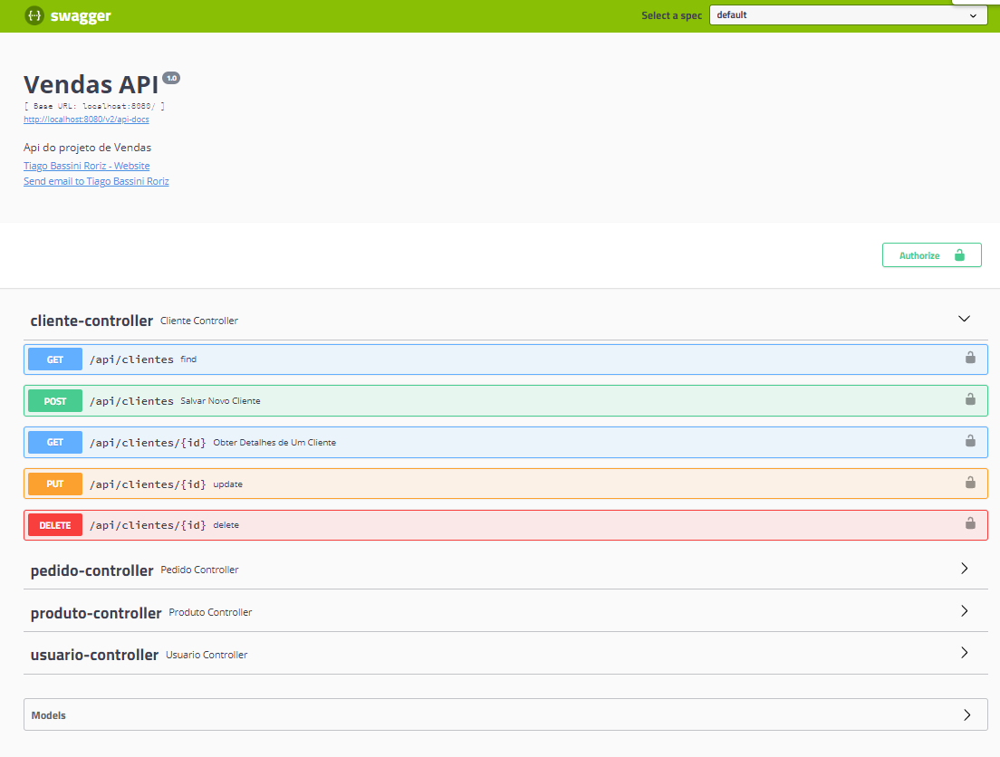

# API Restfull

Desenvolvimento de uma API restfull, para um projeto do backend de um sistema de vendas utilizando as seguintes tecnologias:

- Java
- Spring Boot 
- Spring Data JPA
- Spring Security e JWT
- Documentação da API com Swagger
- H2 e MySQL (em diferentes profiles)

 
  

